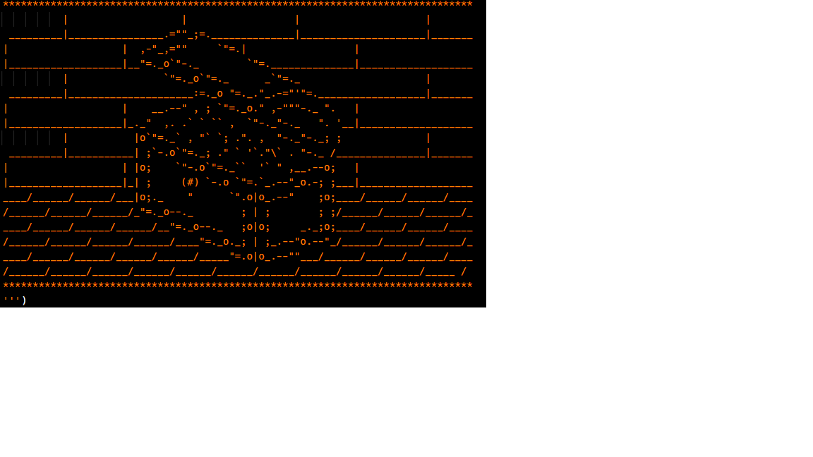

<h1> Treasure-Island-Simple-Game </h1>

The purpose for this activity is practicing and learning (if/elif/else) + (multiple if conditions) through simple treasure-island-game. 
Programing language: Python 
Draw-art: https://ascii.co.uk/art. 

